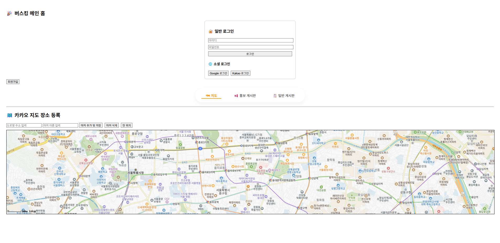
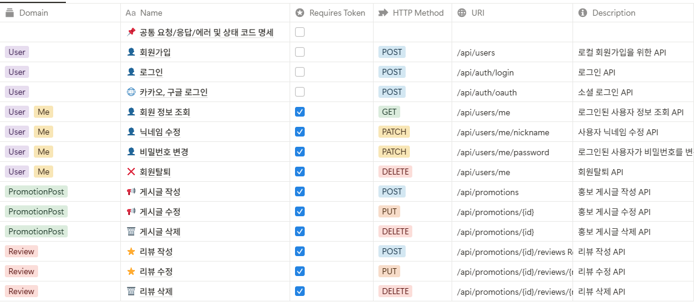

# 🎤 버스킹 현황 게시판 - Soft Team

> 버스커와 관객이 연결되는, 실시간 지도 기반 버스킹 플랫폼

---

## 📸 0. 썸네일



---

## 💡 1. 아이디어 소개

> **버스커들의 공연 일정을 시각적으로 제공하고, 관람객은 위치 기반으로 공연을 탐색할 수 있는 플랫폼**

- 버스커는 자신을 홍보하고, 공연 정보를 등록할 수 있습니다.
- 사용자(관객)는 지도 기반으로 실시간 버스킹 일정을 쉽게 확인할 수 있습니다.
- 리뷰 및 게시판 기능을 통해 공연 후 피드백 및 자유로운 커뮤니케이션이 가능합니다.

### 문제점
- 버스킹 일정 및 위치 정보 제공 채널이 불분명하고 단편적임
- 버스커와 관람객 간의 피드백 창구가 부족함
- 공연 홍보가 개인 SNS에 의존되어 파편화됨

### 해결방안
- 버스킹 일정을 지도 기반으로 통합 제공
- 간편 로그인, 후기 시스템 도입
- 홍보 게시판 및 자유 게시판으로 소통 강화

---

## 🕐 2. 개발 기간

| 구분 | 기간 |
|------|------|
| 전체 개발 | 2025.03 ~ 2025.06 |
| 기능 구현 | 2025.03 ~ 2025.06 |

---

## 👨‍👩‍👧‍👦 3. 팀원 소개 - Soft

| 멤버 | 역할 | GitHub / Email |
|------|------|----------------|
| 신동진 | 🔐 로그인 / 회원가입 기능 | `tlsehdwls201@naver.com` |
| 최용준 | 📚 기능 목록, 📐 ERD 설계, 📄 API 명세서 작성 | `yj9107vv@gmail.com` |
| 유승범 | 🗺️ 카카오맵 연동, 📝 게시판 CRUD | `ysb7021@naver.com` |

> ✅ 역할은 프로젝트 진행에 따라 유동적으로 변경될 수 있습니다.

---

## 🛠 4. 개발 환경

### Backend
- Java 21
- Spring Boot 3.x
- Spring Security, JPA
- MySQL (AWS RDS)
- JWT 기반 인증
- Swagger

### Frontend
- React
- React Router
- Zustand

### 기타
- Kakao Maps API
- AWS EB (배포), aws RDS (DB)

---

## 🔀 5. 브랜치 전략 및 협업 규칙

- `main`: 배포 브랜치
- `develop`: 모든 기능이 merge되는 통합 브랜치
- `feat/*`: 기능 단위 작업 브랜치
- Pull Request는 **2인 이상 리뷰 승인 후** merge 진행

---

## 📁 6. 프로젝트 구조

```plaintext
📦 backend/src
├─main/
│   ├─java/
│   │   ├─busking/
│   │   │   ├─busking_project/
│   │   │   │   BuskingProjectApplication.java
│   │   │   │   SecurityConfig.java
│   │   │   │   WebConfig.java
│   │   │   │   WebController.java
│   │   │   │
│   │   │   │   ├─Busking_Schedule/
│   │   │   │   │   BuskingController.java
│   │   │   │   │   BuskingRepository.java
│   │   │   │   │   BuskingSchedule.java
│   │   │   │   │   BuskingService.java
│   │   │   │   │   BuskingStatus.java
│   │   │   │   │
│   │   │   │   │   ├─dto/
│   │   │   │   │   │   BuskingCreateRequest.java
│   │   │   │   │   │   BuskingResponse.java
│   │   │   │   │   │   LocationWithScheduleDto.java
│   │   │   │
│   │   │   │   ├─base/
│   │   │   │   │   BaseEntity.java
│   │   │   │
│   │   │   │   ├─board/
│   │   │   │   │   BoardPost.java
│   │   │   │   │   BoardPostController.java
│   │   │   │   │   BoardPostRepository.java
│   │   │   │   │   BoardPostService.java
│   │   │   │   │
│   │   │   │   │   ├─dto/
│   │   │   │   │   │   BoardPostRequestDto.java
│   │   │   │   │   │   BoardPostResponseDto.java
│   │   │   │
│   │   │   │   ├─comment/
│   │   │   │   │   Comment.java
│   │   │   │   │   CommentController.java
│   │   │   │   │   CommentRepository.java
│   │   │   │   │   CommentService.java
│   │   │   │   │
│   │   │   │   │   ├─dto/
│   │   │   │   │   │   CommentRequestDto.java
│   │   │   │   │   │   CommentResponseDto.java
│   │   │   │
│   │   │   │   ├─location/
│   │   │   │   │   Location.java
│   │   │   │   │   LocationController.java
│   │   │   │   │   LocationRepository.java
│   │   │   │   │   LocationService.java
│   │   │   │   │
│   │   │   │   │   ├─dto/
│   │   │   │   │   │   LocationCreateRequest.java
│   │   │   │   │   │   LocationResponse.java
│   │   │   │
│   │   │   │   ├─promotion/
│   │   │   │   │   PromotionPost.java
│   │   │   │   │   PromotionPostController.java
│   │   │   │   │   PromotionPostRepository.java
│   │   │   │   │   PromotionPostService.java
│   │   │   │   │
│   │   │   │   │   ├─dto/
│   │   │   │   │   │   PromotionPostRequestDto.java
│   │   │   │   │   │   PromotionPostResponseDto.java
│   │   │   │
│   │   │   │   ├─review/
│   │   │   │   │   Review.java
│   │   │   │   │   ReviewController.java
│   │   │   │   │   ReviewRepository.java
│   │   │   │   │   ReviewService.java
│   │   │   │   │
│   │   │   │   │   ├─dto/
│   │   │   │   │   │   ReviewRequestDto.java
│   │   │   │   │   │   ReviewResponseDto.java
│   │   │   │
│   │   │   │   ├─user/
│   │   │   │   │   User.java
│   │   │   │   │   UserController.java
│   │   │   │   │   UserRepository.java
│   │   │   │   │   UserService.java
│   │   │   │   │
│   │   │   │   │   ├─dto/
│   │   │   │   │   │   RegisterRequestDto.java
│   │   │   │   │   │   UserResponseDto.java
│
📦 frontend/src
├─api/
│   api.js
│   auth.js
│   busking.js
│   board.js
│   comment.js
│   promotion.js
│   review.js
│   user.js
├─components/
│   Header.jsx
│   Footer.jsx
│   Map.jsx
│   BuskingCard.jsx
│   ...
├─pages/
│   HomePage.jsx
│   LoginPage.jsx
│   RegisterPage.jsx
│   BuskingListPage.jsx
│   PromotionListPage.jsx
│   BoardPage.jsx
│   ...
├─App.jsx
├─main.jsx

---

## 📑 7. API 명세서



---

## 🧩 8. 세부 기능 설명

### 🔐 사용자 인증
- 일반 로그인 / 회원가입 (JWT)
- 사용자 정보 조회
- 로그아웃 및 탈퇴

### 🗓 버스킹 일정 관리
- 공연 일정 등록 / 조회 / 삭제
- 일정 상태 자동 변경 (예정 → 진행 중 → 완료)
- 날짜별 필터 기능

### 🗺 장소 관리
- 카카오 지도 기반 마커 등록
- 공연 장소 선택 및 조회
- 중복 예약 방지

### 📢 홍보 게시판
- 공연 홍보용 글 등록/수정/삭제
- 지도에서 마커 클릭 시 공연 정보 팝업
- 후기 작성 기능 연동

### 📝 일반 게시판
- 자유로운 글 작성, 수정, 삭제
- 댓글, 대댓글(답글) 기능
- 조회 수 1회 제한(로그인 사용자 기준)

---

## 🧭 9. ERD

`[ ERD 이미지 (추후 삽입 예정) ]`  
또는 [📌 ERD 문서 보기](docs/erd)

---

## 📌 10. 프로젝트 후기

### 🙊 신동진
- **역할:** 로그인/회원가입 구현
- **후기:** `작성 예정`

### 🍇 최용준
- **역할:** ERD 설계, 기능 구조화, API 문서 작성
- **후기:** `작성 예정`

### 🐶 유승범
- **역할:** 게시판 및 지도 기능 연동
- **후기:** `작성 예정`

---
