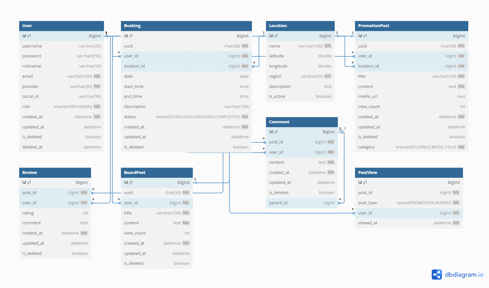

# 🎤 버스킹 현황 게시판 - Soft Team

> 버스커와 관객이 연결되는, 실시간 지도 기반 버스킹 플랫폼

---

## 📸 0. 썸네일


---

## 💡 1. 아이디어 소개

> **버스커들의 공연 일정을 시각적으로 제공하고, 관람객은 위치 기반으로 공연을 탐색할 수 있는 플랫폼**

- 버스커는 자신을 홍보하고, 공연 정보를 등록할 수 있습니다.
- 사용자(관객)는 지도 기반으로 실시간 버스킹 일정을 쉽게 확인할 수 있습니다.
- 리뷰 및 게시판 기능을 통해 공연 후 피드백 및 자유로운 커뮤니케이션이 가능합니다.

### 문제점
- 버스킹 일정 및 위치 정보 제공 채널이 불분명하고 단편적임
- 버스커와 관람객 간의 피드백 창구가 부족함
- 공연 홍보가 개인 SNS에 의존되어 파편화됨

### 해결방안
- 버스킹 일정을 지도 기반으로 통합 제공
- 간편 로그인, 후기 시스템 도입
- 홍보 게시판 및 자유 게시판으로 소통 강화

---

## 🕐 2. 개발 기간

| 구분 | 기간 |
|------|------|
| 전체 개발 | 2025.03 ~ 2025.06 |
| 기능 구현 | 2025.03 ~ 2025.05 |

---

## 👨‍👩‍👧‍👦 3. 팀원 소개 - Soft

| 멤버 | 역할 | GitHub / Email |
|------|------|----------------|
| 신동진 | 🔐 로그인 / 회원가입 기능, 👤 회원 관련 기능 구현 | `tlsehdwls201@naver.com` |
| 최용준 | 📐 ERD 설계, 📚 기능 구조화, 📄 API 명세서 작성, 🧪 User 테스트코드 작성, 🌐 서버 배포 및 AWS DB 연결 | `yj9107vv@gmail.com` |
| 유승범 | 📝 게시판 구현 및 🗺️ 카카오맵 연동, 📄 API 명세서 작성, 🧪 PromotionPost 테스트코드 작성, CI/CD 파이프라인 구축 | `ysb7021@naver.com` |

---

## 🛠 4. 개발 환경

### Backend
- Java 21
- Spring Boot 3.x
- Spring Security, JPA
- MySQL (AWS RDS)
- JWT 기반 인증
- Swagger

### Frontend
- React
- React Router
- Zustand

### 기타
- Kakao Maps API
- AWS EB (배포), aws RDS (DB)

---

## 🔀 5. 브랜치 전략 및 협업 규칙

- `main`: 배포 브랜치
- `develop`: 모든 기능이 merge되는 통합 브랜치
- `feat/*`: 기능 단위 작업 브랜치
- Pull Request는 **2인 이상 리뷰 승인 후** merge 진행

---

## 📁 6. 프로젝트 구조

```plaintext
📦 backend/
├─src/
│
├── main/
│   └── java/
│       └── busking/
│           └── busking_project/
│               ├── BuskingProjectApplication.java
│               ├── SecurityConfig.java
│               ├── WebConfig.java
│               ├── WebController.java
│
│               ├── Busking_Schedule/
│               │   ├── BuskingController.java
│               │   ├── BuskingRepository.java
│               │   ├── BuskingSchedule.java
│               │   ├── BuskingService.java
│               │   ├── BuskingStatus.java
│               │   └── dto/
│               │       ├── BuskingCreateRequest.java
│               │       ├── BuskingResponse.java
│               │       └── LocationWithScheduleDto.java
│
│               ├── base/
│               │   └── BaseEntity.java
│
│               ├── board/
│               │   ├── BoardPost.java
│               │   ├── BoardPostController.java
│               │   ├── BoardPostRepository.java
│               │   ├── BoardPostService.java
│               │   └── dto/
│               │       ├── BoardPostRequestDto.java
│               │       └── BoardPostResponseDto.java
│
│               ├── comment/
│               │   ├── Comment.java
│               │   ├── CommentController.java
│               │   ├── CommentRepository.java
│               │   ├── CommentService.java
│               │   └── dto/
│               │       ├── CommentRequestDto.java
│               │       └── CommentResponseDto.java
│
│               ├── location/
│               │   ├── Location.java
│               │   ├── LocationController.java
│               │   ├── LocationRepository.java
│               │   ├── LocationService.java
│               │   └── dto/
│               │       ├── LocationCreateRequest.java
│               │       └── LocationResponse.java
│
│               ├── promotion/
│               │   ├── PromotionPost.java
│               │   ├── PromotionPostController.java
│               │   ├── PromotionPostRepository.java
│               │   ├── PromotionPostService.java
│               │   └── dto/
│               │       ├── PromotionPostRequestDto.java
│               │       └── PromotionPostResponseDto.java
│
│               ├── review/
│               │   ├── Review.java
│               │   ├── ReviewController.java
│               │   ├── ReviewRepository.java
│               │   ├── ReviewService.java
│               │   └── dto/
│               │       ├── ReviewRequestDto.java
│               │       └── ReviewResponseDto.java
│
│               └── user/
│                   ├── User.java
│                   ├── UserController.java
│                   ├── UserRepository.java
│                   ├── UserService.java
│                   └── dto/
│                       ├── RegisterRequestDto.java
│                       └── UserResponseDto.java
│
├── test/
│   └── java/
│       └── busking/
│           └── busking_project/
│               ├── promotion/
│               │   └── PromotionPostControllerTest.java
│               ├── review/
│               │   └── ReviewControllerTest.java
│               └── user/
│                   └── AuthControllerTest.java
│
📦 frontend/src/
├── api/
│   ├── api.js
│   ├── auth.js
│   ├── busking.js
│   ├── board.js
│   ├── comment.js
│   ├── promotion.js
│   ├── review.js
│   └── user.js
│
├── components/
│   ├── Header.jsx
│   ├── Footer.jsx
│   ├── Map.jsx
│   ├── BuskingCard.jsx
│   └── ...
│
├── pages/
│   ├── HomePage.jsx
│   ├── LoginPage.jsx
│   ├── LoginFailedPage.jsx
│   ├── RegisterPage.jsx
│   ├── BuskingListPage.jsx
│   ├── BuskingCreatePage.jsx
│   ├── BuskingDetailPage.jsx
│   ├── PromotionListPage.jsx
│   ├── PromotionPage.jsx
│   ├── PromotionEditPage.jsx
│   ├── BoardPage.jsx
│   ├── BoardPostPage.jsx
│   ├── BoardEditPage.jsx
│   ├── MyPage.jsx
│   └── ...
│
├── App.jsx
├── main.jsx
```
---

## 📑 7. API 명세서


---

## 🧩 8. 세부 기능 설명

### 🔐 사용자 인증
- 일반 로그인 / 회원가입 (JWT)
- 소셜 로그인 (구글, 카카오 OAuth2)
- 사용자 정보 조회 / 닉네임 수정
- 로그아웃 및 탈퇴 (소프트 삭제 및 복구 기능 포함)

### 🗓 버스킹 일정 관리
- 공연 일정 등록 / 조회 / 삭제
- 일정 상태 자동 변경 (예정 → 진행 중 → 완료)
- 날짜별 필터 기능

### 🗺 장소 관리
- 카카오 지도 기반 마커 등록
- 공연 장소 선택 및 조회
- 중복 예약 방지

### 📢 홍보 게시판
- 공연 홍보용 글 등록/수정/삭제
- 지도에서 마커 클릭 시 공연 정보 팝업
- 후기 작성 기능 연동

### 📝 일반 게시판
- 자유로운 글 작성, 수정, 삭제
- 댓글, 대댓글(답글) 기능
- 조회 수 1회 제한(로그인 사용자 기준)

---

## 🧭 9. ERD

📄 [ERD 구조 보기 (PDF)](docs/erd)  
또는 아래 이미지 참조 👇




---

## 🚀 10. 배포 및 CI/CD
- GitHub Actions 기반 CI/CD 구축
  - develop 브랜치에서 CI 실행
  - main 브랜치 merge 시 AWS EB 자동 배포
- 테스트 환경에서는 H2 DB, 운영 환경에서는 RDS(MySQL) 사용

---

## 📌 11. 프로젝트 후기

### 🙊 신동진 - 백엔드
- **후기:** `작성 예정`

### 🍇 최용준 - 백엔드
> 프로젝트 주제를 선정한 후 별다른 준비 없이 바로 개발을 시작했습니다. 하지만 초기 단계에서 개발 순서에 대한 이해와 Git과 GitHub을 활용한 협업 방식에 대한 지식이 부족해, 이후에 대규모 리팩토링이 필요해졌고 팀원 간 코드 병합과 동기화에 많은 어려움이 있었습니다. 이로 인해 협업의 효율성이 저하되었고 프로젝트의 진행 속도도 크게 느려지는 문제가 발생했습니다.
> 
> 이 문제를 해결하기 위해 개발 순서를 명확히 숙지하고, 진행 중이던 기능 구현을 일시 중단한 뒤 ERD 설계, API 명세서 작성 등 가장 기본적인 설계 과정을 다시 탄탄히 다졌습니다. 또한 Git과 GitHub 사용법을 직접 공부하여 팀원들과 공유한 결과, 협업 과정이 훨씬 원활해졌습니다.
> 
> 이번 프로젝트는 처음이라 부족하고 낯선 부분이 많아 어려움이 컸지만, 팀원들과 매주 적극적으로 의견을 나누고 문제를 개선하는 과정을 통해 앞으로 내가 무엇을 더 공부해야 할지 깨닫게 된 소중한 시간이었습니다. 단순한 기능 구현뿐 아니라, 개발 순서의 중요성, Git과 GitHub을 활용한 협업 방식, CI/CD 환경 설정, 테스트 코드 작성과 적용 방식 등 실무에서 요구되는 다양한 요소들을 직접 경험하면서, 복합적인 개발 역량 전반을 고루 갖추는 것이 중요하다는 점을 깊이 느꼈습니다.
> 
> 프로젝트 경험이 없는 상태에서도 끝까지 포기하지 않고 최선을 다해준 팀원들 정말 고생 많았고, 덕분에 좋은 결과를 만들어낼 수 있었습니다. 모두 정말 고맙습니다!`

### 🐶 유승범 - 백엔드/프론트엔드
- **후기:** `작성 예정`

---
