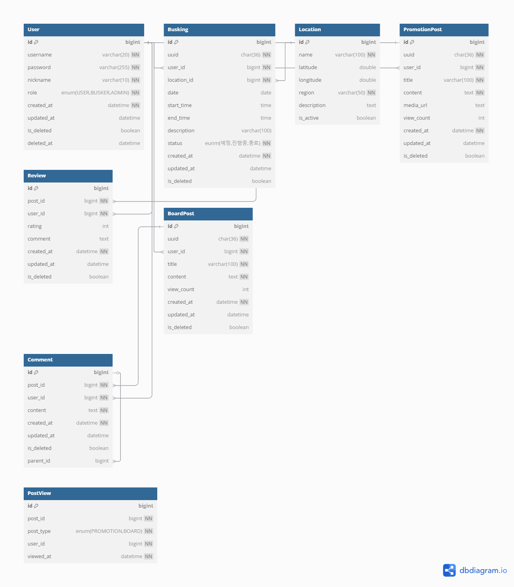

## 📘 ERD 설계

### ✅ 1. ERD 시각화 이미지 미리보기
> ERD 전체 구조를 한눈에 확인할 수 있다 👇

---

### ✅ 2. ERD 관련 파일 정리

| 파일명 | 설명 |
|--------|------|
| [ERD_논리설계.md](ERD_논리설계.md) | 테이블 구조 및 제약조건 정리 |
| [ERD_시각화.txt](ERD_시각화_코드.txt) | dbdiagram.io 기반 ERD 코드 (txt 형식) |
| [ERD_시각화.pdf](ERD_시각화.pdf) | ERD 시각화 다이어그램 (PDF 보기용) |

---

### 💡 기타 참고

- `ERD_시각화.txt` 파일은 [https://dbdiagram.io](https://dbdiagram.io)에서 복사 → 붙여넣으면 바로 시각화된다.
